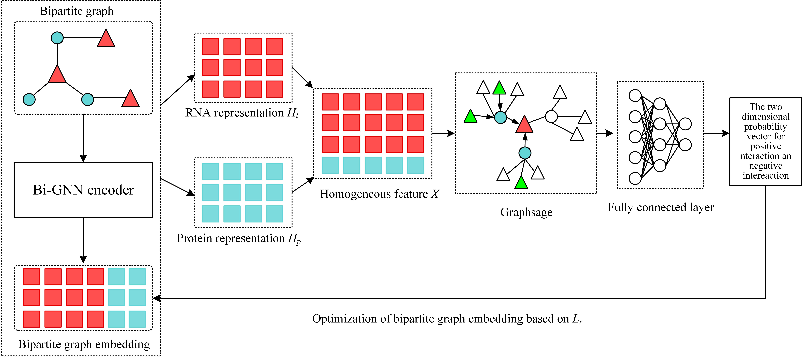

# Predicting lncRNA-protein interactions with bipartite graph embedding and deep graph neural networks

Code for our paper "Predicting lncRNA-protein interactions with
bipartite graph embedding and deep graph neural
networks"

## Requirements

The code has been tested running under Python 3.8.8, with the following packages and their dependencies installed:

```
Windows environment
numpy==1.20.1
pytorch==1.11.0
sklearn==0.24.1
```
### Model Framework



#### Optional parameters
--dataset : default='NPInter2_55' replacement from four data sets : NPInter2_55, NPInter2_46, NPinter3.0_human_46, NPinter3.0_human_55, NPInter3.0_mouse_46, NPInter3.0_mouse_55, RPI2241_46 and RPI2241_55
